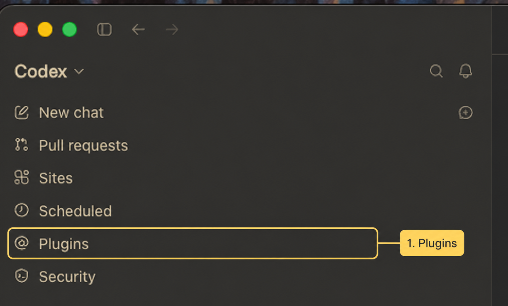
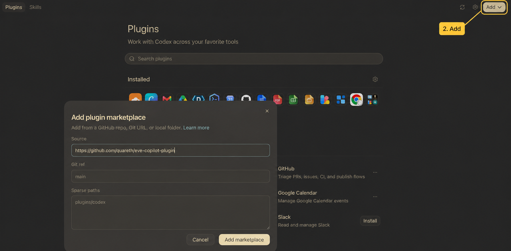

# EVE Copilot

[](./docs/examples/README.md)
[](./docs/client-setup/chatgpt-codex.md)
[](./docs/client-setup/claude-desktop.md)
[](./docs/plugin-system.md)
[](./LICENSE)

EVE Online is enormous, complicated, and not especially kind to new players.
There is always another mechanic, fitting rule, dangerous site, skill dependency,
or expensive mistake waiting to be discovered.

AI can be a fantastic guide, but a normal chat does not know your character. It
may recommend a fit that exceeds your CPU with your current skills, send you
into an exploration site without mentioning that failed hacks can destroy the
containers, or give advice so generic that you still have to research everything
yourself. Constantly leaving the game to explain your ship, location, skills,
and budget also gets old quickly.

This started as a hobby project to solve my own problem as a new player. I built
EVE Copilot as a character-aware EVE companion for ChatGPT and Codex. It
connects the conversation to your EVE character and gives the AI a set of
focused exploration, combat, mining, hauling, fitting, navigation, market, and
memory tools. The goal is simple: spend less time repeating context and more
time actually playing EVE.

I normally use it with voice chat left open while I play. When I speak, ChatGPT
can check where I am, what I am flying, how the ship is fitted, and which skills
I have instead of asking me to type all of that again. Voice chat is not
required, but it is the most natural way I have found to use the project during
an active expedition.

## Skills and copilots

EVE Copilot includes focused skills for different parts of the game.
Exploration, mining, and hauling also have separate preparation and active
copilots, because planning in a station and making decisions while exposed in
space are very different jobs.

| Skill or copilot | What it does |
|---|---|
| **EVE Copilot gateway** | Applies the selected in-universe persona to gameplay, lore, and pilot-advisory requests while leaving plugin management, development, and unrelated ChatGPT topics neutral. |
| **Exploration preparation** | Plans a data or relic expedition around your character, current location, ship, fit, route, risk, and extraction plan. |
| **Active exploration** | Gives short next-step guidance while you scan, travel, enter sites, watch for danger, retreat, and bring the loot home. |
| **Wormhole expedition** | Records reported jumps and return bookmarks in temporary character memory, then routes you back to the starting system. |
| **Combat** | Chooses or reviews PvE and PvP ships using your skills, owned ships, saved fits, budget, environment, and combat goal. |
| **Mining preparation** | Plans ore, ice, gas, moon, Mercoxit, wormhole, or Pochven operations, including ship choice, fitting, hauling, compression, and escape. |
| **Active mining** | Helps with immediate cycle, repositioning, threat, evacuation, hauling, and extraction decisions while you are in space. |
| **Hauling preparation** | Plans a compact personal cargo move using your assets, owned ships, skills, route, trip count, and destination. |
| **Active hauling** | Gives short hold, jump, dock, wait, reroute, turn-back, and delivery guidance while cargo is in motion. |
| **Setup** | Installs the local tools and EVE data, then guides you through connecting a character when you want character-aware help. |
| **Persona** | Changes the copilot's persona between neutral, Amarr, Caldari, Gallente, and Minmatar without changing its facts or advice. |
| **Uninstall** | Removes the plugin and, if requested, its local character credentials, data, and memory. |

These skills can use the shared fitting checker, route and market information,
character skills and assets, current ship and location, and a private local
guide that remembers useful conclusions between conversations.

Some example questions:

- “Plan a data and relic expedition from where I am now.”
- “Start a wormhole expedition from my current location.”
- “Can I actually use this fit with my current skills?”
- “Improve my current ship without exceeding its CPU or powergrid.”
- “What should I take for a lowsec exploration run, and what can kill me?”
- “Prepare a mining trip using ships I already own.”
- “Move these assets to Jita using a ship I already own.”
- “Where did I leave my Astero?”
- “Keep guiding me while I run this site.”

## Example usage

One real exploration session follows the whole trip: EVE Copilot checks the
character and ship, prepares the expedition, helps with a site while the pilot
is in space, and compares where to sell the loot afterward.

[](./docs/examples/exploration-expedition.md)

Market prices, activity, routes, and character state shown here are snapshots
from that session and will change.

[](./docs/examples/README.md)

## What makes it different from a normal AI chat

EVE Copilot combines a few useful ideas in one plugin:

- **MCP tools** connect the AI to EVE's APIs and a local copy of EVE's static
  data.
- **Topic-gated identity** applies the configured copilot persona to in-game
  EVE requests while leaving plugin management, repository work, and unrelated
  ChatGPT conversations unchanged.
- **Character context** lets it reason about your location, ship, fitting,
  skills, assets, wallet, and other authorized information.
- **Dedicated skills** cover exploration, temporary wormhole-expedition
  mapping, combat, mining, and hauling, with separate preparation and
  live-operation profiles where immediate in-space decisions need a faster
  response.
- **Local memory** keeps useful player-specific notes and conclusions available
  for later conversations.
- **Fitting calculations** give the AI something better than generic fits copied
  from the internet.

The plugin does not include its own AI model and does not need a separate model
API key. The ChatGPT/Codex application supplies the conversation and model; EVE
Copilot supplies the EVE context and tools.

## Character-aware fitting

When EVE Copilot recommends a fit, it can evaluate it against the selected
character's skills instead of assuming an all-level-V pilot. It checks:

- CPU and powergrid;
- high, medium, low, rig, and service slots where supported;
- turret and launcher hardpoints;
- rig size and calibration;
- module, charge, and drone compatibility;
- drone bay, bandwidth, and active-drone limits;
- recursive skill requirements;
- supported capacitor operating profiles.

The fitting analyzer uses the calculation core and generated JavaScript loader
from [EVEShipFit/dogma-engine](https://github.com/EVEShipFit/dogma-engine) to
apply EVE attributes, effects, and the selected character's skills. EVE Copilot
connects the calculator to its local EVE data and uses a small adapter for the
CPU, powergrid, capacitor, timing, and drone calculations above.

It is a fitting checker, not a complete combat simulator. Damage application,
tank, mining yield, residue, command bursts, fleet effects, capacitor injection,
ancillary mechanics, and subsystem fitting still need other evidence or in-game
verification. The exact boundary is listed in the
[known limitations](./docs/limitations.md).

## Where the information comes from

Character information comes from EVE's official ESI API after you connect and
authorize a character. Ship, module, system, blueprint, skill-requirement, and
Dogma facts come from an explicitly installed copy of the official EVE Static
Data Export.

The API cannot see everything happening around you. EVE Copilot cannot inspect
your screen, Local, D-scan, probe scanner, wormhole condition, or the immediate
grid. During live play it will ask you for those observations when they matter.

Market and character data also follow ESI's normal cache windows, so they should
not be treated as a live order book or an instant danger warning.

## Install in ChatGPT/Codex

You need ChatGPT/Codex, Git, Node.js `>=24 <27`, npm, and access to this public
repository.

### Install from the desktop app

1. Open **Plugins** from the left sidebar.

   

2. Select **Add** in the upper-right corner, then choose
   **Add plugin marketplace**.

   

3. Enter these marketplace settings:

   - **Source:** `https://github.com/quareth/eve-copilot-plugin`
   - **Git ref:** `main`
   - **Sparse paths:** leave empty

4. Select **Add marketplace**, find **EVE Copilot**, and install it.

### Command-line alternative

You can register the same marketplace and install the plugin from a terminal:

```sh
codex plugin marketplace add quareth/eve-copilot-plugin --ref main
codex plugin add eve-copilot@eve-copilot
```

Restart the ChatGPT desktop app, start a new conversation, and say:

> Set up EVE Copilot.

The setup guide checks the required software, installs the local runtime and EVE
static data, and walks you through character connection if you want it. You do
not need to clone or build the repository manually.

If you’re not sure how the setup works or don’t have the technical knowledge to
do it yourself, Codex can handle the entire process for you. However, there is
one thing you should know:

### A quick heads-up

> [!IMPORTANT]
> Once you add the plugin, Codex can take care of the rest of the setup. To do
> that, it may need to install a few things and make changes on your computer.
> Only continue if you’re comfortable letting an AI assistant do that. It will
> ask for your permission before it starts.

Connecting a character requires an application in the official EVE Developers
Portal. The setup guide explains the fields and permissions. EVE Copilot uses
PKCE, so it needs the public Client ID but not a client secret. Your EVE password,
authenticator code, and tokens should never be pasted into the conversation.

See the [ChatGPT/Codex setup guide](./docs/client-setup/chatgpt-codex.md) for the
full walkthrough.

### Claude support

The repository includes Claude Code and Claude Desktop integration files, but I
have not personally tested them yet. If you want to try them, start with the
[Claude setup guide](./docs/client-setup/claude-desktop.md).

### Manual commands

The setup guide normally runs these for you, but they are also available
directly:

```sh
eve-copilot-mcp setup --use-default-user-agent
eve-copilot-mcp setup
eve-copilot-mcp sde install
eve-copilot-mcp doctor
```

To change the copilot's voice later:

```sh
eve-copilot-mcp setup --persona <none|amarr|caldari|gallente|minmatar>
```

Restart the host or begin a new conversation after changing the persona.

## Privacy and actions

- The MCP server and its working data run locally on your computer.
- EVE tokens are kept in the operating system's protected credential store, not
  in the plugin files or SQLite database.
- Character caches, installed static data, fitting inputs, and private guide
  pages remain local. Information used in a conversation is then subject to the
  host application's data controls.
- Read permissions are requested as they are needed.
- ESI write actions are off by default. If enabled, the plugin asks for fresh
  confirmation before performing the prepared action.
- The plugin does not control the EVE client or automate gameplay.

More detail is available in [privacy](./docs/privacy.md),
[scope bundles](./docs/scope-bundles.md), and
[action safety](./docs/action-safety.md).

## Removing it

Ask **“Uninstall EVE Copilot”** for guided removal. It can remove only the host
plugin or also purge local character authorizations, configuration, databases,
static data, and private guide pages. It does not delete a separate Git checkout
unless you explicitly ask it to.

## Using only the MCP server

The local MCP server can also be built and registered without the plugin skills
and agents:

```sh
npm ci
npm run build
npm install --global .
codex mcp add eve-copilot -- eve-copilot-mcp serve
```

This gives an MCP client access to the tools and resources, but not the complete
exploration, combat, mining, and hauling experience supplied by the plugin.

## Development

```sh
npm ci
npm run check
npm run build
```

Useful project documentation:

- [Plugin structure](./docs/plugin-system.md)
- [Capability catalog](./docs/capability-catalog.md)
- [Known limitations](./docs/limitations.md)
- [Troubleshooting](./docs/troubleshooting.md)
- [Host compatibility](./docs/client-setup/compatibility-matrix.md)

## Credits

Parts of EVE Copilot's configuration parsing, SQLite setup, secret redaction,
and ESI capability discovery were adapted from
[EVE AI Agent](https://github.com/garshany/eveai).

The fitting calculator uses parts of
[EVEShipFit/dogma-engine](https://github.com/EVEShipFit/dogma-engine).

See [NOTICE](./NOTICE) and the
[attribution ledger](./docs/attribution.md) for the complete acknowledgments.

EVE Copilot is available under the [MIT License](./LICENSE).

EVE Copilot is an independent project and is not affiliated with or endorsed by
CCP hf.
