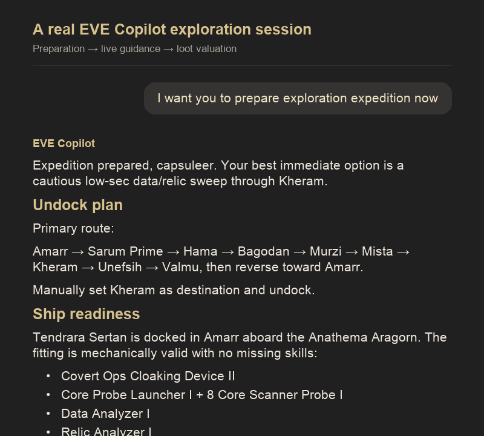
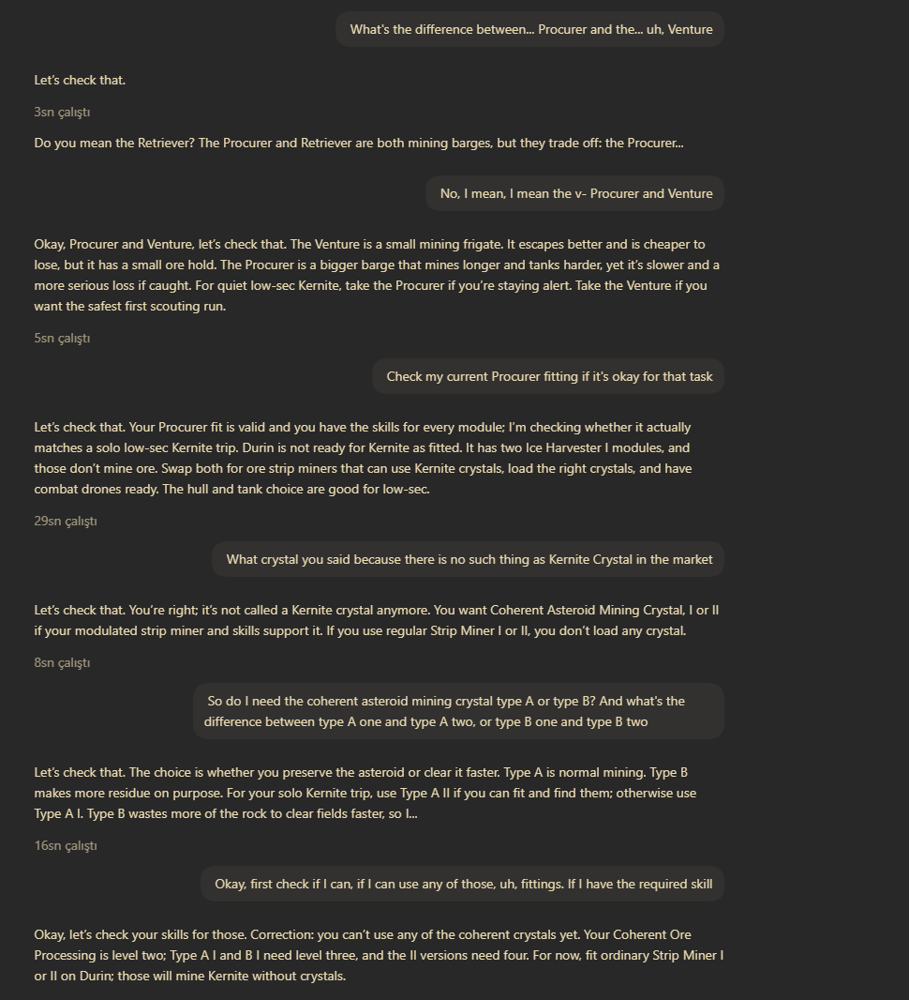
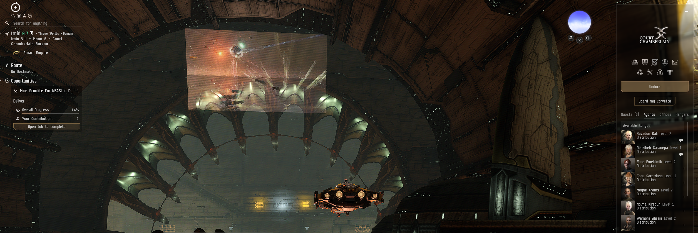
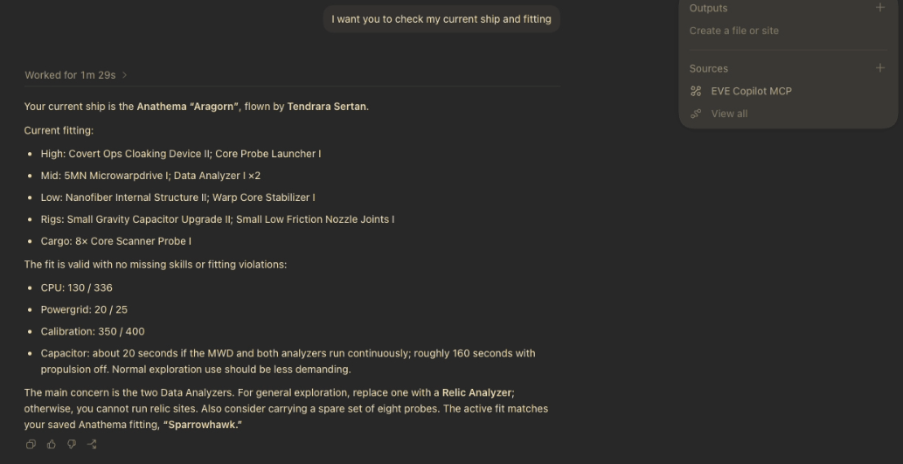
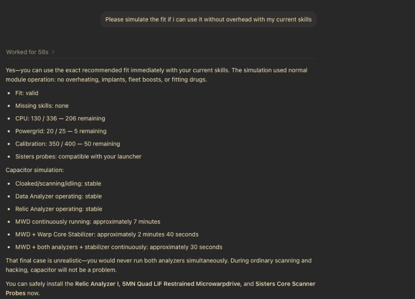
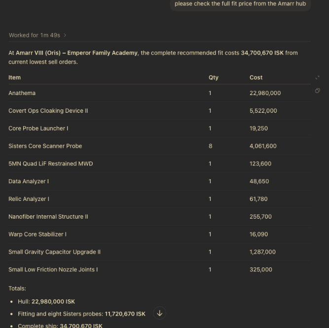
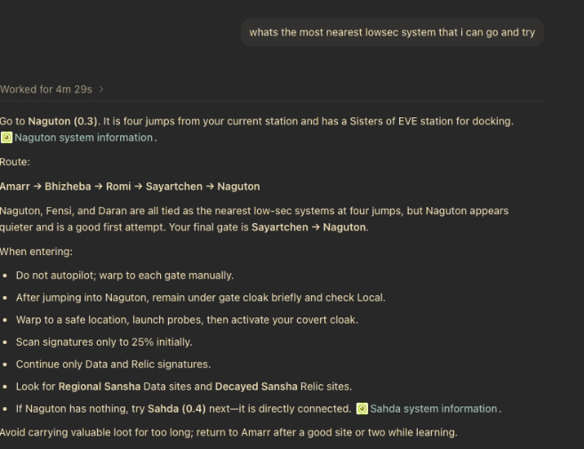
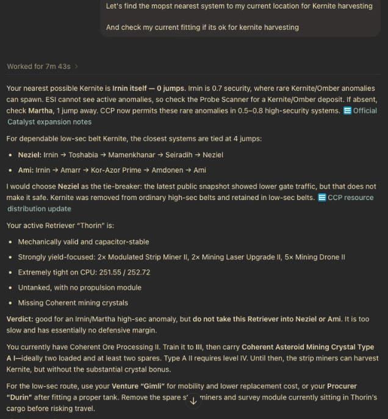

# EVE Copilot examples

These examples come from actual EVE Copilot sessions rather than invented
mockups. The exploration animation is rendered from its real transcript; the
remaining images are direct screenshots. Market prices, traffic, routes,
character state, and other live information are snapshots from the time of
each conversation.

## Exploration expedition

The copilot checks the character's location, ship, fitting, and skills; prepares
a low-sec route and extraction plan; answers a site-entry question during the
expedition; and compares the recovered loot's immediate-sale value in Mamet and
Amarr.

## Voice chat while playing

Voice chat lets the conversation continue without repeatedly leaving EVE or
typing out the current situation. The first screenshot shows the transcript of
a spoken mining conversation. The second shows ChatGPT voice chat kept open
over the game.

> **ChatGPT Voice limitation:** In this project's experience, ChatGPT's native
> Voice conversation is more lightweight than written chat. It works well for
> quick questions and immediate guidance, but long planning, detailed
> comparisons, and multi-step tool work may be shorter or less thorough. For
> those tasks, switch to written chat or ask Voice to start a separate task.
> This is a limitation of the ChatGPT voice experience rather than EVE Copilot.
> See the official [ChatGPT Voice documentation](https://learn.chatgpt.com/docs/features/voice).

*The voice transcript remains conversational, including corrections and
follow-up questions.*

*Voice chat can remain open alongside EVE while the copilot uses the connected
character context and tools.*

## Current ship and fitting

EVE Copilot can inspect the selected character's current ship and fitting,
identify problems, and validate proposed changes against the character's actual
skills and fitting limits.

## Market and route planning

The copilot can compare current market orders for a complete fit and combine
route information with practical travel guidance.

## Mining preparation

Mining preparation combines the character's current location, nearby resource
possibilities, owned ships, fitting, skills, and travel risk.

